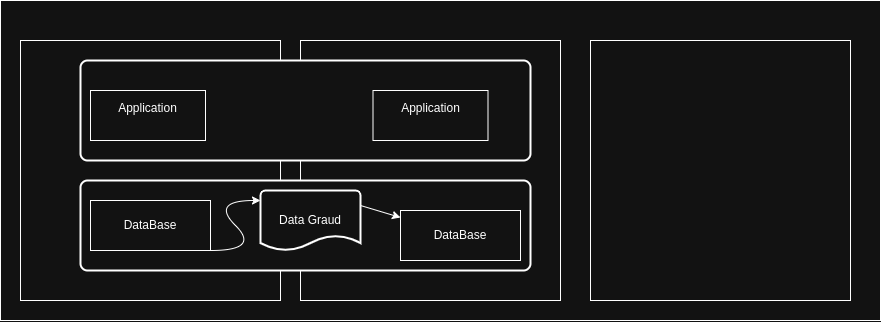

# OCI Introduction 

> Outline 

    - OCI Architecture
    - OCI Console Walk-through 

--- 

## OCI Architecutre 

### OCI Levles ??

- Regions
    - Availability Domains **AD** 
        - Fault Domains **FD**

> How To Choose a Region 
    - Location `place colse to your users`
    - Data Residency and Compliance `strict data`
    - Service Availability `Cloud Service`

> Availability Domains
    - any Region contains 3 `AD` 
    - isolated from each other 
    - Physical Infrastructure not shared 
        - Fault Domains
            - any `AD` contains 3 `FD` 
            - Logical Data Center Within an `AD`
            - Resources placed in different **FD** will not share single points of Hardware failuer ??
    
            
> Simple Application 

> What is **Data Guard** ? 
    - Service to ensure your data are **Sync** between Your Data 

> Summary 
    - `FD` > Protect Single Point of failuer `App`
    - `AD` > Proctect Single Point of failuer `FD`
    - `Regin` > At least 2 Datacenter 

> `SLA(Service level of agreement)` on Availability, Managment, and Performance 
---

## Demo: OCI Console Walk-through

> [oci](https://cloud.oracle.com)

